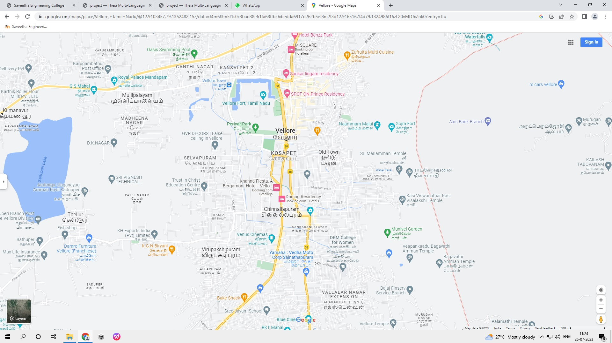
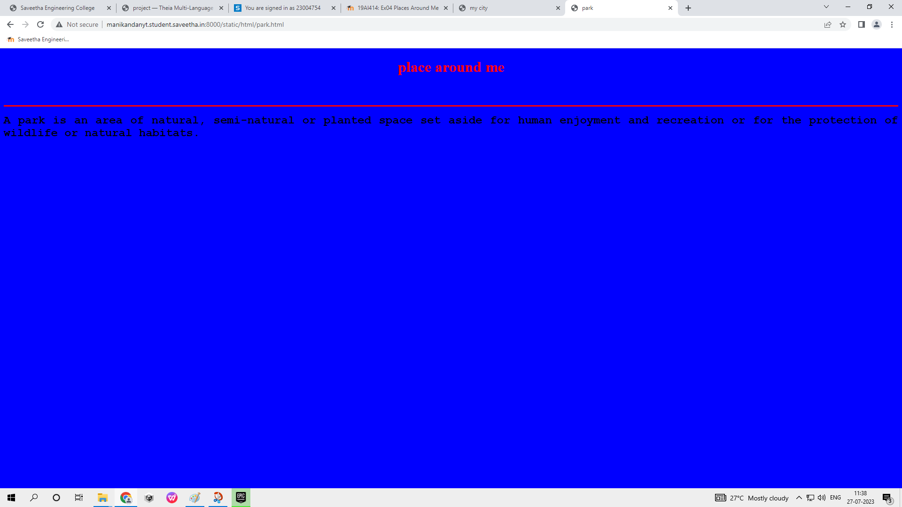
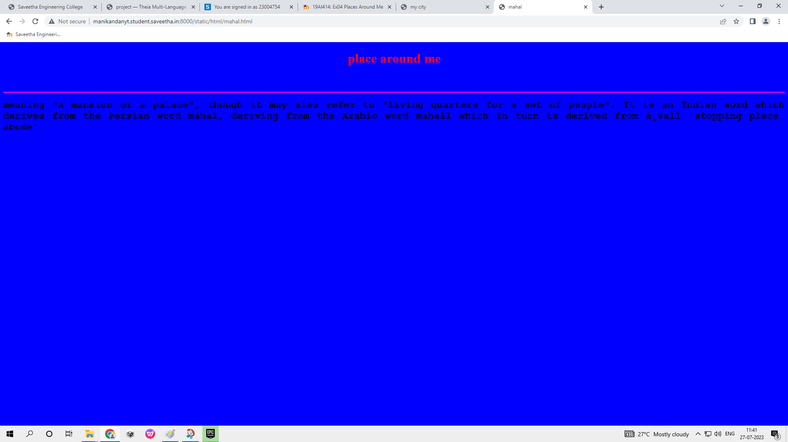
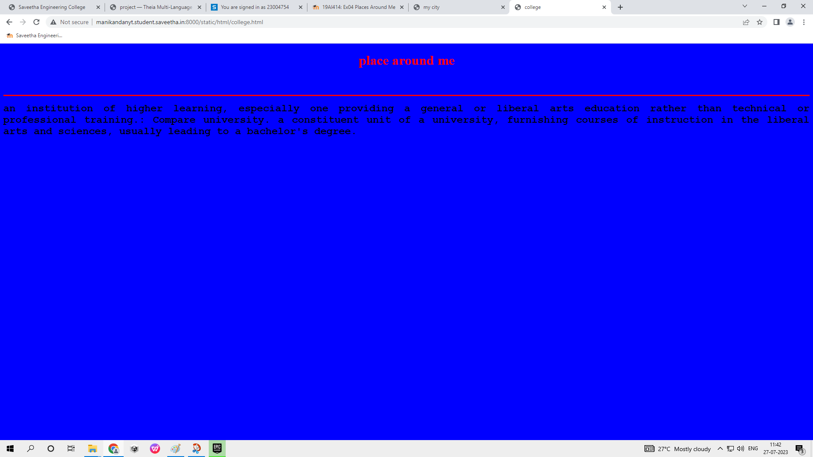
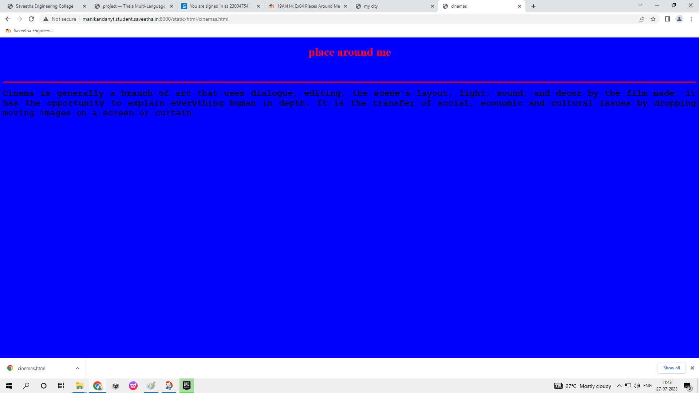
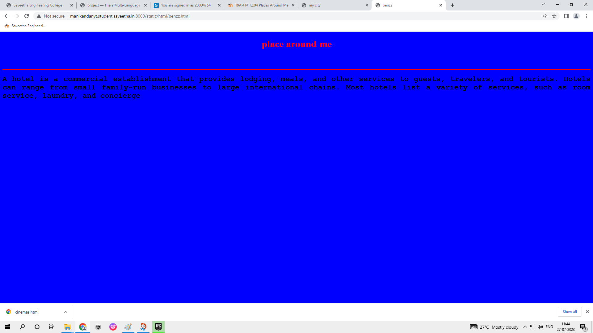

# Places Around Me
## AIM:
To develop a website to display details about the places around my house.

## Design Steps:

### Step 1:
Write your own steps here.
### Step 2:

## Code:
```
<!DOCTYPE html>

<html lang="en">

<head>

<title>park</title>

</head>

<body bgcolor="blue">

<h1 align="center">

<font color="red"><b>place around me</b></font>

</h1>

<h3 align="center">

<font color="blue"><b>my city</b></font>

</h3>

<hr size="3" color="red">


<p align="justify">

<font face="Courier New" size="5">

<b>
A park is an area of natural, semi-natural or planted space set aside for human enjoyment and recreation or for the protection of wildlife or natural habitats.

</b>

</font>

</p>

</body>

</html>

<!DOCTYPE html>

<html lang="en">

<head>

<title>mahal</title>

</head>

<body bgcolor="blue">

<h1 align="center">

<font color="red"><b>place around me</b></font>

</h1>

<h3 align="center">

<font color="blue"><b>my city</b></font>

</h3>

<hr size="3" color="dark red">

<p align="justify">

<font face="Courier New" size="5">

<b>
meaning "a mansion or a palace", though it may also refer to "living quarters for a set of people". It is an Indian word which derives from the Persian word mahal, deriving from the Arabic word mahall which in turn is derived from ḥall 'stopping place, abode'.

 
</b>

</font>

</p>

</body>

</html>

<!DOCTYPE html>

<html lang="en">

<head>

<title>college</title>

</head>

<body bgcolor="blue">

<h1 align="center">

<font color="red"><b>place around me</b></font>

</h1>

<h3 align="center">

<font color="blue"><b>my city</b></font>

</h3>

<hr size="3" color="red">


<p align="justify">

<font face="Courier New" size="5">

<b>
an institution of higher learning, especially one providing a general or liberal arts education rather than technical or professional training.: Compare university. a constituent unit of a university, furnishing courses of instruction in the liberal arts and sciences, usually leading to a bachelor's degree.

</b>

</font>

</p>

</body>

</html>

<!DOCTYPE html>

<html lang="en">

<head>

<title>cinemas</title>

</head>

<body bgcolor="blue">

<h1 align="center">

<font color="red"><b>place around me</b></font>

</h1>

<h3 align="center">

<font color="blue"><b>my city</b></font>

</h3>

<hr size="3" color="red">


<p align="justify">

<font face="Courier New" size="5">

<b>
Cinema is generally a branch of art that uses dialogue, editing, the scene's layout, light, sound, and decor by the film made. It has the opportunity to explain everything human in depth. It is the transfer of social, economic and cultural issues by dropping moving images on a screen or curtain.

</b>

</font>

</p>

</body>

</html>

<!DOCTYPE html>

<html lang="en">

<head>

<title>benzz</title>

</head>

<body bgcolor="blue">

<h1 align="center">

<font color="red"><b>place around me</b></font>

</h1>

<h3 align="center">

<font color="blue"><b>my city</b></font>

</h3>

<hr size="3" color="red">


<p align="justify">

<font face="Courier New" size="5">

<b>
A hotel is a commercial establishment that provides lodging, meals, and other services to guests, travelers, and tourists. Hotels can range from small family-run businesses to large international chains. Most hotels list a variety of services, such as room service, laundry, and concierge

</b>

</font>

</p>

</body>

</html>
```
## Output:







## Result:
The program for implemention image map is executed successfully